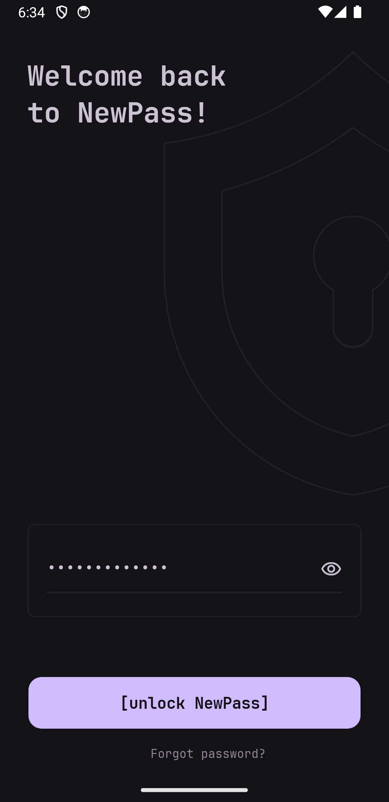
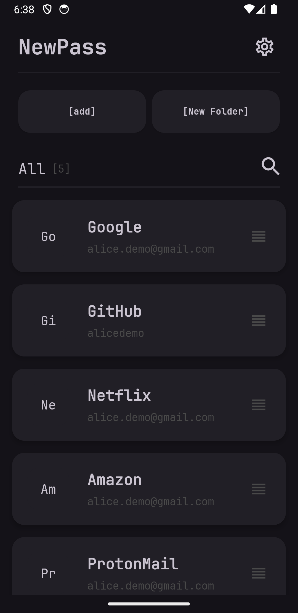
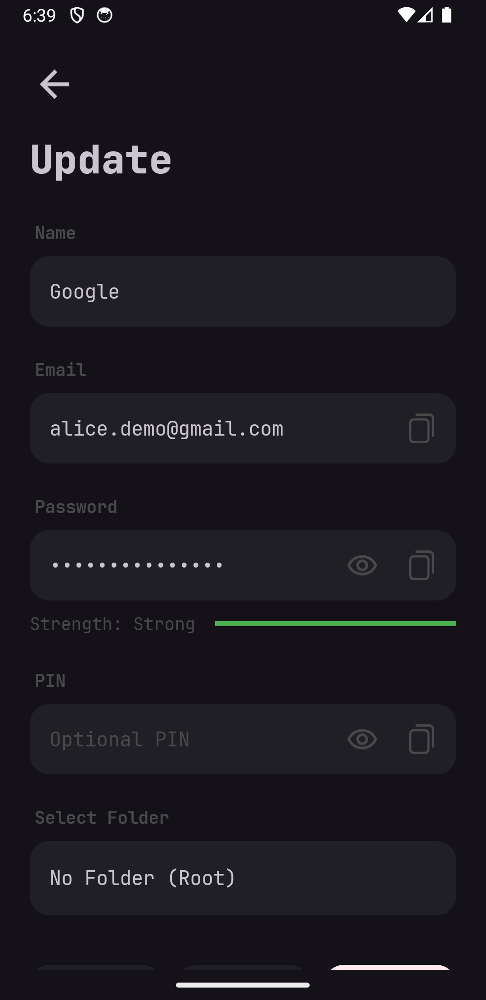
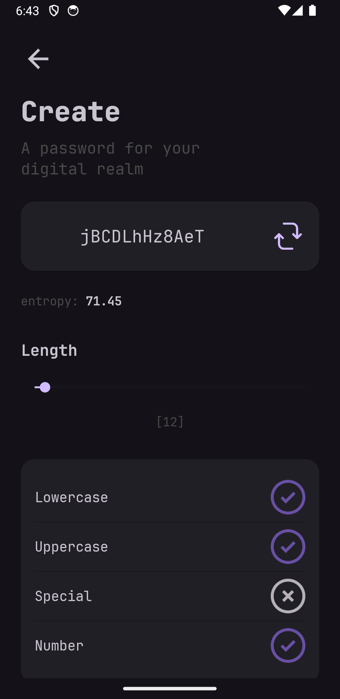
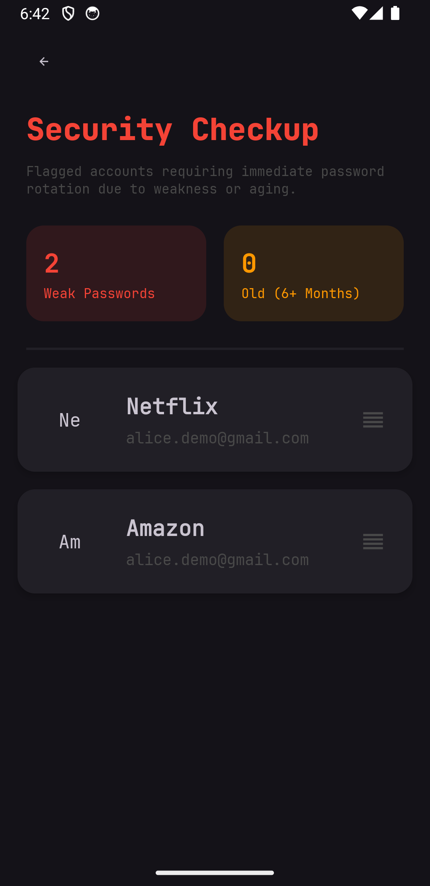
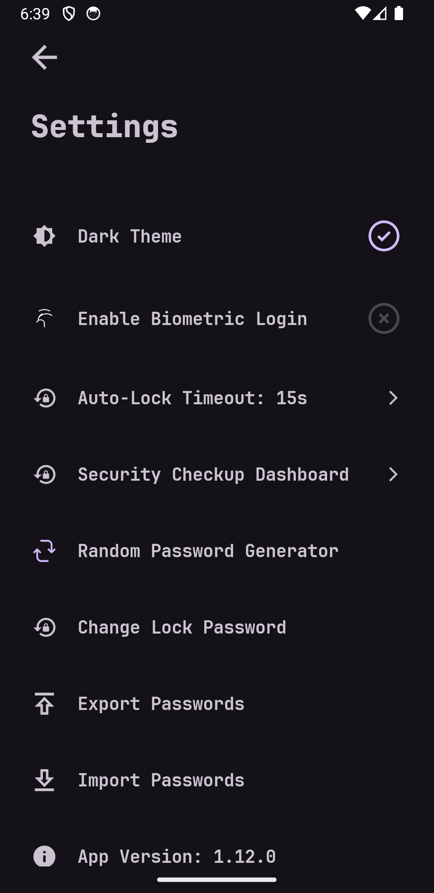
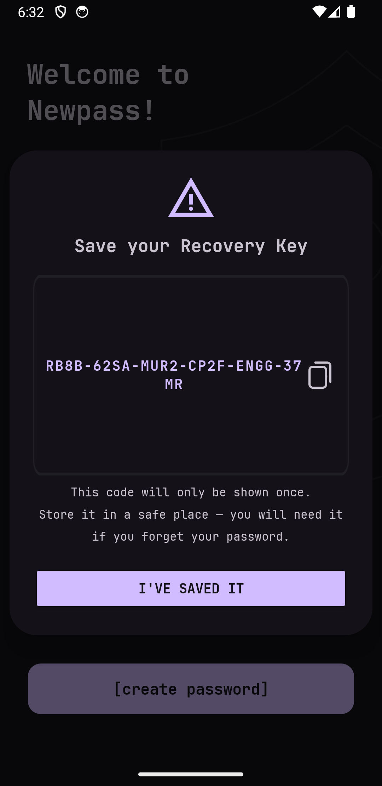

<div align="center">
  <h1>🔒 NewPass</h1>
  <p><strong>A beautifully secure, fully offline Android password manager.</strong></p>

  <p>
    
    
    
    
  </p>
</div>

---

## 📖 Overview

**NewPass** is a privacy-first Android application that stores, organizes, and manages
your passwords completely offline. It requests **no internet permission at all**, so your
data physically cannot leave your device. All secrets live in an encrypted database that
is unlocked only by your master password (or, optionally, a strong biometric).

NewPass is meant for **personal and family use** — sharing a self-built APK with people you
trust. It is not published on the Play Store. See [Security model](#-security-model) for
the exact threat model it does and does not cover.

> NewPass is a fork of [`6eero/NewPass`](https://github.com/6eero/NewPass), extended with
> account recovery, a security dashboard, auto-lock, persistent brute-force lockout, and
> release-signing hardening. Licensed under **GPL-3.0**, same as upstream.

---

## ✨ Features

### 🛡️ Security

| Area | What it does |
| --- | --- |
| **Offline only** | No internet permission is declared. Nothing syncs, nothing phones home. |
| **Encrypted database** | All records are stored in SQLCipher (AES-256). The database key is derived from your master password. |
| **Password hashing** | Master password and recovery code are hashed with PBKDF2-HMAC-SHA256, 600,000 iterations, random 16-byte salt. |
| **Field encryption** | Individual fields are additionally encrypted with AES-GCM using an Android Keystore key. |
| **Biometric unlock (opt-in)** | The master-password hash is wrapped by an Android Keystore RSA key that only a **strong** biometric (`BIOMETRIC_STRONG`) can use. Re-enrolling a fingerprint or changing the password invalidates it. |
| **Account recovery** | A one-time 24-character recovery code (shown once, stored only as a PBKDF2 hash) can reset a forgotten master password. Using it consumes the old code and issues a new one. |
| **Persistent brute-force lockout** | After 6 failed master-password attempts the vault locks and biometric unlock is removed. Recovery-code attempts escalate: 5 min → 15 min → 1 hour → 24 hours, then an explicit manual vault wipe. Counters survive app restarts. |
| **Auto-lock** | The vault locks automatically after a configurable idle timeout (default 15 seconds), including time spent in the background. |
| **Screenshot / recents protection** | `FLAG_SECURE` blocks screenshots and hides vault content in the app switcher. |
| **Safe clipboard** | Copied secrets are flagged sensitive (Android 13+ `IS_SENSITIVE`) and wiped from the clipboard after 30 seconds. |
| **Signature verification** | At runtime the app checks its own signing certificate SHA-256 against the official release fingerprint, and is aware of Android 16 Advanced Protection Mode. |
| **Backup hardened** | `allowBackup="false"` plus Android 12+ data-extraction rules exclude the database and preferences from cloud backup and device-to-device transfer. |

### 🎨 App

- **Password strength meter** — estimates entropy from character-pool size and length as
  you type, with penalties for repeated / uniform characters, shown on a Weak → Fair →
  Good → Strong scale.
- **Security dashboard** — scans the vault and flags weak passwords and entries not
  updated in over 6 months.
- **Last-updated tracking** — each entry records when it was last changed.
- **Password generator** — configurable length plus uppercase / numbers / symbols toggles.
- **Folders** — organize entries into custom folders.
- **Encrypted JSON export / import** — export the vault to a portable `.json` file
  encrypted with a separate export password (AES-GCM, PBKDF2 600k iterations); import it
  back on any device.
- **9 languages** — English, Spanish, French, Hindi, Italian, Portuguese (BR), Russian,
  Turkish, Chinese.
- **Light & dark themes.**

---

## 📱 Screenshots

<div align="center">
  
  
  
  
  
  
</div>

<p align="center"><sub>Captured on an Android 14 emulator with demo data. Recovery-key screen shown on first vault creation:</sub></p>

<div align="center">
  
</div>

---

## 🚀 Getting Started

### Install

Grab the latest signed APK from the
[Releases](https://github.com/handsomelee002-ui/NewPass/releases) page and install it on a
device running **Android 7.0 (API 24)** or newer.

### Build from source

**Requirements:** Android Studio (or the Android SDK) with **JDK 17** and Android SDK
platform 36.

```bash
git clone https://github.com/handsomelee002-ui/NewPass.git
cd NewPass
./gradlew assembleDebug
```

The debug APK is written to `app/build/outputs/apk/debug/`.

### Build a signed release

Release builds fail unless signing is configured. Provide these values in
`local.properties` (git-ignored) or as environment variables, then build:

| Property | Meaning |
| --- | --- |
| `NEWPASS_RELEASE_STORE_FILE` | Path to your release keystore |
| `NEWPASS_RELEASE_STORE_PASSWORD` | Keystore password |
| `NEWPASS_RELEASE_KEY_ALIAS` | Key alias |
| `NEWPASS_RELEASE_KEY_PASSWORD` | Key password |
| `NEWPASS_RELEASE_SIGNATURE_SHA256` | SHA-256 fingerprint of that certificate (used for the runtime signature check) |

```bash
./gradlew assembleRelease
```

Keep the keystore and these values backed up somewhere safe — every future update must be
signed with the same key. Never commit `local.properties` or the keystore.

---

## 🛠️ Tech Stack

- **Language / build:** Java 17, Android Gradle Plugin 9.1.0, Gradle wrapper.
- **SDK:** `minSdk 24`, `targetSdk 36`, `compileSdk 36`.
- **UI:** XML layouts, single-activity + Fragments, ViewBinding / DataBinding, MVVM
  (`ViewModel` + `LiveData`).
- **Crypto & storage:** `net.zetetic:sqlcipher-android`, `androidx.security:security-crypto`
  (`EncryptedSharedPreferences`), `AndroidKeyStore`, `androidx.biometric`
  (`BiometricPrompt.CryptoObject`).
- **Release:** R8 minification, resource shrinking, ProGuard rules that strip logging.

---

## 🔐 Security Model

**Designed for:** keeping your passwords private if your phone is lost, stolen, inspected,
or restored from a cloud backup. The database is encrypted at rest, the app has no network
access, and secrets are hard to extract from screenshots, backups, or the clipboard.

**Not designed for:** a compromised device (malware, a rooted phone under an attacker's
control, a hostile OS). A determined attacker with your unlocked device or your master
password gets your vault.

**Known residual items** (see [`AUDIT_REPORT.md`](AUDIT_REPORT.md) for the full audit):

- The SQLCipher key passes through an immutable Java `String` that cannot be wiped
  explicitly.
- Export file security depends entirely on the strength of the export password you choose.
- Master-password UI throttling is per-process; SQLCipher + PBKDF2 still slow offline
  attacks, but the on-screen delay resets if the process is killed.
- Two AndroidX crypto dependencies are on alpha versions.

If you find a security issue, please open a
[private report](https://github.com/handsomelee002-ui/NewPass/security/advisories/new)
rather than a public issue.

---

## 🤝 Contributing

Issues and pull requests are welcome. Bug-report and feature-request templates are in
[`.github/ISSUE_TEMPLATE`](.github/ISSUE_TEMPLATE). A GitHub Actions workflow builds a
debug APK on every push.

---

## 📜 License

Licensed under the **GNU General Public License v3.0** — see [`LICENSE`](LICENSE).

NewPass is derived from [`6eero/NewPass`](https://github.com/6eero/NewPass), which is also
GPL-3.0. If you distribute this app or a modified version, you must keep it under GPL-3.0
and make the corresponding source available.
